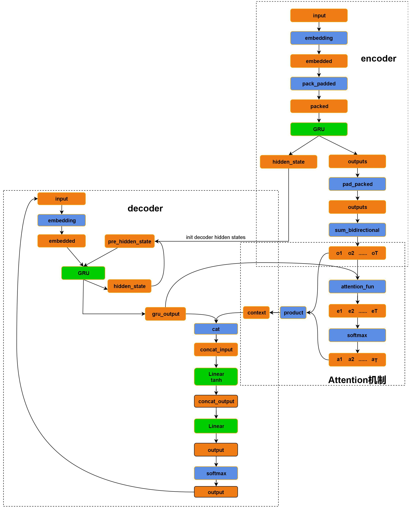

## Machine Translation
machine translation based on encoder-attention-decoder architecture.

### dataset
https://nlp.stanford.edu/projects/nmt/

### Reference
[seq2seq](https://github.com/bentrevett/pytorch-seq2seq)

